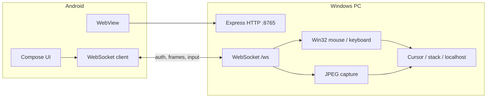

# Remote PC

**Control your Windows development machine from Android — on the same Wi‑Fi, over a hotspot, or from elsewhere via a relay or VPN.**

Remote PC turns a phone into a lightweight remote workstation: you see the PC screen, send mouse and keyboard input, and open web apps in a built-in browser. **Cursor, PHP, MySQL, Apache/Laragon, Node.js, and `localhost` services stay on the PC** — the phone is only a display, input device, and browser client.

Designed for developers who want to step away from the desk without shutting down their stack or reconfiguring their IDE.

---

## Table of contents

- [Features](#features)
- [How it works](#how-it-works)
- [Requirements](#requirements)
- [Connection options](#connection-options)
- [Quick start](#quick-start)
- [Android app](#android-app)
- [Typical workflow](#typical-workflow)
- [Configuration](#configuration)
- [Security](#security)
- [Project structure](#project-structure)
- [Documentation](#documentation)
- [Limitations (MVP)](#limitations-mvp)
- [License](#license)

---

## Features

| Area | What you get |
| --- | --- |
| **Remote desktop** | JPEG screen stream over WebSocket (~720p-class, configurable quality/FPS) |
| **Mouse** | Tap, double-tap, long-press (right click), drag, two-finger scroll, pinch zoom on the remote view |
| **Keyboard** | Modifiers (Ctrl/Shift/Alt/Win), navigation keys, IDE shortcuts (Ctrl+S/C/V/Z, Ctrl+`, etc.), Unicode text field |
| **Pairing** | One-time 6-digit code; device tokens stored as hashes on the server |
| **Local web** | WebView to `http://<pc-ip>/…` — **not** `localhost` on the phone |
| **Projects** | Quick links from server config (e.g. Laragon sites, Vite dev server) |
| **Resilience** | Auto-reconnect on Wi-Fi drop (token retained on the phone) |
| **Operator console** | Loopback-only UI on the PC: LAN IP, pairing code, connected devices, remote-control toggle |
| **Internet mode** | Optional relay: PC connects **outbound**; phone uses Relay URL + Node ID (no home router port-forward) |

---

## Connection options

Phones and PCs on **different networks** cannot reach each other by private IP alone (NAT/firewall). You need either a **shared network** or a **rendezvous path** on the internet.

| Situation | What to use | Own VPS? |
| --- | --- | --- |
| Same Wi‑Fi at home/office | App: **Wi‑Fi (LAN)** + PC LAN IP | No |
| PC uses phone **hotspot** (one shared network) | **Wi‑Fi (LAN)** + PC IP on hotspot (e.g. `192.168.x.x`) | No |
| Phone on mobile data, PC at home | **Tailscale** (or ZeroTier) on PC + phone, then **LAN** mode to the PC’s VPN IP | No |
| Phone on mobile data, no VPN | App: **Internet** + self-hosted [relay](docs/setup-internet.md) on a small VPS | Yes (or any cloud VM) |

You do **not** have to run `relay/` if Tailscale or “same hotspot / same Wi‑Fi” is enough for you. The built-in relay is for when the PC can make outbound WebSocket connections but you do not want to port-forward **8765** on your router.

**LOCALHOST** in the app (preview `http://<pc-ip>/…`) works best on **LAN** or VPN. Over pure Internet mode, use **REMOTE** for the desktop, or **Projects** with URLs that are reachable from the phone (public/staging sites).

---

## How it works



- **Android** — Kotlin, Jetpack Compose; min SDK 26 (Android 8.0+).
- **Windows server** — Node.js 20+, TypeScript, Express, `ws`, screen capture + `sharp`, native input via `koffi`.

- **LAN** — direct to `http://<pc-ip>:8765` and `ws://…/ws`.
- **Internet** — `https://<relay>/n/<nodeId>/…` via the optional [relay](docs/setup-internet.md) service.

---

## Requirements

| Component | Requirement |
| --- | --- |
| PC | Windows 10/11 |
| Network | Same Wi‑Fi/hotspot (LAN), VPN mesh (e.g. Tailscale), or relay for Internet mode |
| Runtime | [Node.js](https://nodejs.org/) 20+ |
| Phone | Android 8.0+ (API 26) |
| Build (optional) | JDK 17, Android SDK / Android Studio |

---

## Quick start

### 1. Start the server on Windows

```bat
cd server
npm install
npm run dev
```

- Listens on `0.0.0.0:8765` (configurable).
- Open the operator console on **this PC only**: [http://127.0.0.1:8765/console](http://127.0.0.1:8765/console) — note the **LAN IP** and **pairing code**.
- Health check:

```bat
curl.exe http://127.0.0.1:8765/health
```

Production-style run (no file watcher):

```bat
cd server
npm start
```

### 2. Allow the firewall (Private network only)

Allow inbound **TCP 8765** on the **Private** profile. Do not expose this port on the public internet or router port-forwarding.

See [docs/setup-windows.md](docs/setup-windows.md) for a PowerShell firewall example and Laragon/Vite LAN binding.

### 3. Pair and connect on Android

1. Install the app (build below or use a debug APK).
2. Choose **Wi‑Fi (LAN)** or **Internet** on the home screen.
   - **LAN:** PC **LAN IP** (e.g. `192.168.1.100`) and port **8765**.
   - **Internet:** **Relay URL** and **Node ID** from the PC console (`relay.enabled` in `server/config.json`). See [docs/setup-internet.md](docs/setup-internet.md).
3. **Pair** with the 6-digit code from the PC console (always on the PC at `127.0.0.1`).
4. **Connect** — status should show online, then open **REMOTE**, **LOCALHOST**, or **PROJECTS**.

Never use `localhost` as the host on the phone; it refers to the phone itself.

---

## Android app

### Build debug APK

```bat
cd android
set JAVA_HOME=C:\Java\jdk-17
gradlew.bat assembleDebug
```

Output: `android/app/build/outputs/apk/debug/app-debug.apk`

Open `android/` in Android Studio to run on a device. Ensure `android/local.properties` points at your Android SDK.

### Remote screen gestures

| Gesture | Action |
| --- | --- |
| Single tap | Left click |
| Double tap | Double click |
| Long press | Right click |
| Drag | Mouse move while held |
| Two-finger move | Scroll (vertical; horizontal where supported) |
| Pinch / zoom controls | Zoom remote view (FIT toggle in toolbar) |

### Keyboard panel

- Latch **Ctrl / Shift / Alt / Win**, then tap a key for combos (e.g. Ctrl+S).
- Scroll pads for wheel and horizontal scroll.
- Shortcut row for common editor commands.

Details: [docs/setup-android.md](docs/setup-android.md).

---

## Typical workflow

1. Run your stack on the PC (Cursor, Laragon, `npm run dev -- --host`, etc.).
2. Start `npm run dev` in `server/`.
3. Connect the phone on the same Wi‑Fi and pair once.
4. Use **REMOTE** to control Cursor and the desktop.
5. Use **LOCALHOST** / **PROJECTS** to preview sites at `http://<pc-ip>/…`.

---

## Configuration

Edit `server/config.json` on the PC:

```json
{
  "port": 8765,
  "host": "0.0.0.0",
  "remoteControl": true,
  "screenQuality": 70,
  "maxFps": 15,
  "projects": [
    { "name": "My site", "url": "http://{pcIp}/myapp" }
  ],
  "relay": {
    "enabled": false,
    "url": "https://relay.yourdomain.com",
    "nodeId": "my-pc",
    "secret": ""
  }
}
```

`{pcIp}` is replaced with the detected LAN address when the app fetches projects. Leave `relay.secret` empty once; the server generates and saves it. Set `relay.enabled` to `true` only when running the [relay](docs/setup-internet.md) service.

Pairing codes and device token **hashes** live under `server/data/` (gitignored). Tokens are never stored in plaintext on the server.

---

## Security

Designed for **your** machines on trusted networks. Harden further before exposing beyond LAN/VPN.

- Pairing code + **hashed** bearer tokens; unauthorized WebSocket clients are rejected.
- Operator console and pairing-code APIs are **loopback-only** (`127.0.0.1`).
- Remote control can be disabled from the PC console.
- Prefer **LAN**, **hotspot**, or **Tailscale** over public exposure. If you use **relay**, run it with **HTTPS/WSS** and treat the relay host as sensitive infrastructure.
- **Do not** port-forward 8765 to the open internet unless you fully understand the risk.

---

## Project structure

```text
remote-code/
├── server/          # Windows Node.js server (HTTP + WebSocket + capture + input)
├── relay/           # Optional internet relay (deploy on VPS)
├── android/         # Kotlin / Jetpack Compose client
├── docs/            # Architecture, protocol, setup guides
├── plan.md          # Product / phase notes (reference)
└── README.md
```

---

## Documentation

| Document | Description |
| --- | --- |
| [docs/architecture.md](docs/architecture.md) | Components, data on disk, scope |
| [docs/protocol.md](docs/protocol.md) | HTTP routes and WebSocket message types |
| [docs/setup-windows.md](docs/setup-windows.md) | Firewall, Laragon/Vite, pairing |
| [docs/setup-android.md](docs/setup-android.md) | Build, modes, gestures, errors |
| [docs/setup-internet.md](docs/setup-internet.md) | Relay server, `config.json` relay, Internet mode on Android |

---

## Limitations (MVP)

Not included in the current release:

- File explorer, remote terminal, clipboard sync, audio
- Multi-PC switching
- H.264 / WebRTC (JPEG streaming only)

---

## License

[MIT](LICENSE) — Copyright (c) 2026 Purb0 Andrian.

---

**Repository:** [github.com/purbo013/remote-pc](https://github.com/purbo013/remote-pc)
